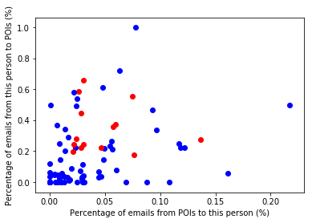
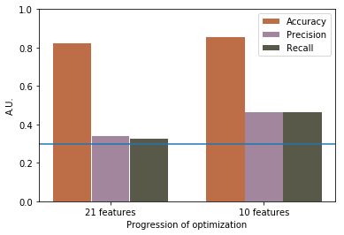
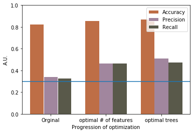

## Introduction
In 2000, Enron was one of the largest companies in the United States. By 2002,
it had collapsed into bankruptcy due to widespread corporate fraud. In the
resulting Federal investigation, a significant amount of typically confidential
 information entered into the public record, including tens of thousands of
 emails and detailed financial data for top executives.
 In this project, I built machine learning algorithms to identify Enron
 Employees who may have committed fraud (who are called persons of interest,
   POI, in the following) based on the public Enron financial and email dataset.

More specifically, a dataset of persons and features associated with them is
given, and then the goal is to build a classifier algorithm around it that can
predict if individuals should be flagged as POIs or not. This is a dataset of
146 points (before cleaning of outlier points) and 21 features.

## Data exploration
The aggregated Enron email & financial dataset is stored in a dictionary,
where each key-value pair in the dictionary corresponds to one person. The
dictionary key is the person's name, and the value is another dictionary, which
contains the names of all the features and their values for that person. The
 features in the data fall into three major types:

>1. financial features (14 in total): e.g `salary`, `loan_advances`, `bonus`, etc
(all units are in US dollars).
>2. email features (6 in total): the number of emails received (`to_messages`),
the number of emails from POI (`from_poi_to_this_person`), etc (units are
  generally number of emails messages)
>3. POI label (1 in total) (1 means that this person is a POI, vice versa)

A brief overview of the dataset:
>1. It includes the information of 146 people.
>2. Among them, there 18 POI (person of interest) and 128 non-POI.
>3. For each person, there are total 21 features and corresponding values
recorded.

## Outliers investigation
To identify the outliers, I start looking at the salary and bonus of each
person in this dataset. From the scatter plot, I found that a person's salary
is generally proportion to his/her bonus. In addition, red dots are chosen for
POIs and blue dots, non-POIs. However, a non-POI point at the top right corner
appears to be unusually distant from the rest of the data.

Then with the use of list comprehension [1], "total" is identified to be this
distinct observation! In fact, it is likely a spreadsheet quirk since the
spreadsheet added up all the data points automatically as it was generated.

After this removal, I look into the remaining data points again. In this case,
points with salary larger than $1,000,000 or bonus more than $5,000,000 are
considered as outliers. A vertical and a horizontal line are drawn,
respectively, to assist the identification.

Five points fall into this category in which either salary larger than
$1,000,000 or bonus more than $5,000,000. Based on the coloration, three of
these five points are people of interest (red dots). Using a list comprehension,
 the names corresponding to the outliers are:
>1. John J Lavorato
>2. Kenneth L Lay
>3. Timothy N Belden
>4. Jeffrey K Skilling
>5. Mark A Frevert

It turns out that Kenneth L Lay is the former chairman and CEO, Jeffrey Skilling
 is the former president and COO, and Timothy N Belden is the former head of
 trading in Enron Energy Services. Three of them are definitely people of
 interest. However, the other two people, i.e., John J Lavorato and Mark A
 Frevert seem to be outliers and we may remove them to improve the modeling
 accuracy later.

## Feature selection and optimization
As POIs, they might have particularly strong email connections between each
other. In other words, they send each other emails at a higher rate than people
in the population at large who send emails to POIs. Two new features are
therefore defined to measure the strength of the email connections, which are:

>● Percentage of emails from POIs to this person (%) = # emails from POI to this
person / # emails to this person

>● Percentage of emails from this person to POIs (%) = # emails from this person
to POI / # emails from this person

They are plotted in the figure below and POIs are in red dots while non-POIs are
in blue dots.

To figure the importance of each feature which is either financial or email
features, SelectKBest (a univariate feature selection) is used. Note that
'email_address' is not included since it contains text strings, and 'other' is
not used either since this feature is not clearly defined. In addition,
MinMaxScaler is deployed to scale each feature to the range between 0 and 1, and
that score comes from f_classif, which represents ANOVA F-value (the linear
  dependency between each feature and label) [2, 3] between label and features.

Few observations:
>1. The difference between the max and min score is roughly an order of magnitude.
>2. The financial features in general have higher ranking than email features.
>3. One of the new features "Percentage of emails from this person to POIs (%)"
>(`fraction_to_poi`) is ranked 5th.

## Algorithms
|   |Decision Trees   | Logistic Regression  |
|---|---|---|
| Accuracy  |0.81|0.78|
| Precision  |0.29|0.17|
| Recall  |0.27|0.17|

Since the label is binary, intuitively I would assume logistic regressions shall
give a better performance even without tuning the parameters. However, it is
found that decision tree outperforms logistic regression in their original
forms. The precision and recall for logistic regression are particularly low.
Thus, in the following, the decision tree is selected for optimization.

## Tuning parameters
Decision tree and logistic regression are selected to build the models.
GridCVSearch and Pipeline are used to expedite the parameters optimization
[4, 5].

Firstly, I want to figure out the optimal number of features before going into
the optimization of the algorithms. This step is made easy by GridCVSearch and
Pipeline as well! Without these two, this would be a very tedious and
perhaps time-consuming work.

Given the classifier is the decision tree with all the default setting, the
optimal number of features is found to be 6, when no optimization of the
decision tree is employed. Accuracy, Precision and Recall all show improvement
with the number of features is reduced from 21 to 6, shown in the bar chart
below [6]:

The minimum requirement of the performance is to have both precision and recall
larger than 0.3, and a blue line is added on the chart representing this
threshold. Accuracy improves slightly: 0.81 to 0.82, but both precision and
recall improve quite a bit. Precision increases from 0.29 to 0.37, and recall
from 0.27 to 0.39. The model performance has passed the threshold before
the parameter of the decision tree is optimized!

The 6 selected features are:
>1. `exercised_stock_options`
>2. `total_stock_value`
>3. `bonus`
>4. `salary`
>5. `fraction_to_poi`
>6. `shared_receipt_with_poi`

Note that the first five selected are the top five in F-value ranking, while
the sixth `shared_receipt_with_poi` is not. In addition, the new feature
`fraction_to_poi` is included in this selection.

Now, we begin to optimize and tune the parameters for the decision tree,
including:

>1. criterion: gini or entropy
>2. maximum depth
>3. maximum leaf nodes
>4. minimum samples leaf
>5. minimum samples split

Stratified ShuffleSplit cross-validator is employed as well. A further
optimization on the parameters of the decision tree results in the improvement
on the precision as shown below.

And we visualize the decision tree [7]:

Parameter setting that corresponds to the optimal tree:

>1. criterion: entropy
>2. maximum depth: 5
>3. maximum leaf nodes: None
>4. minimum samples leaf: 1
>5. minimum samples split: 2

## Model Validation and Performance
After the model is built by the training data set, the performance of this model
 (i.e. the classifier) is estimated by a separate testing dataset. In addition,
 the testing data can serve as check on over-fitting. Here k-fold
 cross-validation is applied to generalize the splitting the data set into
 the training and the testing data set.
 What is k-fold cross-validation? "The original sample is randomly partitioned
 into k equal sized subsamples. Of the k subsamples, a single subsample is
 retained as the validation data for testing the model, and the remaining k − 1
 subsamples are used as training data. The cross-validation process is then
 repeated k times, with each of the k subsamples used exactly once as the
 validation data. The k results can then be averaged to produce a single
 estimation." [8]

To evaluate the performance of the model, precision, recall and accuracy are
used.
<!---
To do:
1. go through this writing again
2. give each reference a title
3. submit the project
--->
<!---
## Reflection
--->

References:
>1. https://discussions.udacity.com/t/encore-des-outliers-2nd-last-part-of-the-outliers-section/31747
>2. https://stackoverflow.com/questions/49214001/what-do-these-f-scores-mean-using-selectkbest-feature
>3. http://scikit-learn.org/stable/modules/feature_selection.html#univariate-feature-selection
>4. https://discussions.udacity.com/t/how-to-find-out-the-features-selected-by-selectkbest/45118
>5. https://discussions.udacity.com/t/how-to-use-pipeline-for-feature-scalling/164178
>6. https://python-graph-gallery.com/11-grouped-barplot/
>7. https://stackoverflow.com/questions/42891148/changing-colors-for-decision-tree-plot-created-using-export-graphviz
>8. https://en.wikipedia.org/wiki/Cross-validation_(statistics)
