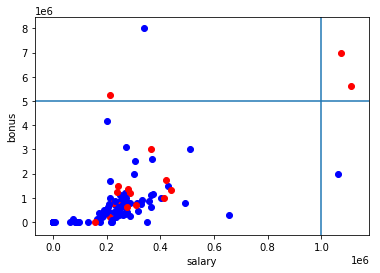
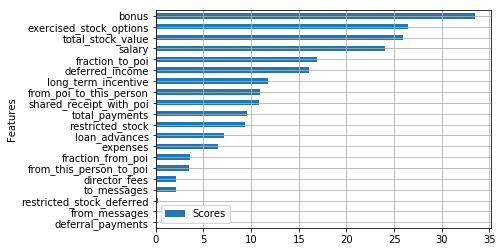

## Introduction
In 2000, Enron was one of the largest companies in the United States. By 2002,
it had collapsed into bankruptcy due to widespread corporate fraud. In the
resulting Federal investigation, a significant amount of typically confidential
 information entered into the public record, including tens of thousands of
 emails and detailed financial data for top executives.
 In this project, I built machine learning algorithms to identify Enron
 Employees who may have committed fraud (who are called persons of interest,
   POI, in the following) based on the public Enron financial and email dataset.

More specifically, a dataset of persons and features associated with them is
given, and then the goal is to build a classifier algorithm around it that can
predict if individuals should be flagged as POIs or not. This is a dataset of
146 points (before cleaning of outlier points) and 21 features.

## Data exploration
The aggregated Enron email & financial dataset is stored in a dictionary,
where each key-value pair in the dictionary corresponds to one person. The
dictionary key is the person's name, and the value is another dictionary, which
contains the names of all the features and their values for that person. The
 features in the data fall into three major types:

1. financial features (14 in total): ['salary', 'deferral_payments',
'total_payments', 'loan_advances', 'bonus', 'restricted_stock_deferred',
'deferred_income', 'total_stock_value', 'expenses', 'exercised_stock_options',
'other', 'long_term_incentive', 'restricted_stock', 'director_fees']
(all units are in US dollars)

2. email features (6 in total): ['to_messages', 'email_address',
'from_poi_to_this_person', 'from_messages', 'from_this_person_to_poi',
'shared_receipt_with_poi'] (units   are generally number of emails messages;
  notable exception is ‘email_address’, which is a text string)

3. POI label (1 in total): [‘poi’] (boolean, represented as integer)

Dictionary is stored as a pickle file, which is the format of the data source
for this project. A brief overview of the dataset is as follows:
1. It includes the information of 146 people.
2. Among them, there 18 POI (person of interest) and 128 non-POI.
3. For each person, there are total 21 features and corresponding values
recorded.

## Outliers investigation
To identify the outliers, I start looking at the salary and bonus of each
person in this dataset. From the scatter plot, I found that a person's salary
is generally proportion to his/her bonus. In addition, red dots are chosen for
POIs and blue dots, non-POIs. However, a non-POI point at the top right corner
appears to be unusually distant from the rest of the data.

Then with the use of list comprehension, "total" is identified to be this
distinct observation! In fact, it is likely a spreadsheet quirk since the
spreadsheet added up all the data points automatically as it was generated.

After this removal, I look into the remaining data points again. In this case,
points with salary larger than $1,000,000 or bonus more than $5,000,000 are
considered as outliers. A vertical and a horizontal line are drawn,
respectively, to assist the identification.

Five points fall into this category in which either salary larger than
$1,000,000 or bonus more than $5,000,000. Based on the coloration, three of
these five points are people of interest (red dots). Using a list comprehension,
 the names corresponding to the outliers are:
1. John J Lavorato
2. Kenneth L Lay
3. Timothy N Belden
4. Jeffrey K Skilling
5. Mark A Frevert

It turns out that Kenneth L Lay is the former chairman and CEO, Jeffrey Skilling
 is the former president and COO, and Timothy N Belden is the former head of
 trading in Enron Energy Services. Three of them are definitely people of
 interest. However, the other two people, i.e., John J Lavorato and Mark A
 Frevert seem to be outliers and we may remove them to improve the modeling
 accuracy later.

## Feature selection and optimization
As POIs, they might have particularly strong email connections between each
other. In other words, they send each other emails at a higher rate than people
in the population at large who send emails to POIs. Two new features are
therefore defined to measure the strength of the email connections.

To figure the importance of each feature which is either financial or email
features, SelectKBest (a univariate feature selection) is used. Note that
'email_address' is not included since it contains text strings, and 'other' is
not used either since this feature is not clearly defined. In addition,
MinMaxScaler is deployed to scale each feature to the range between 0 and 1. Out
of curiosity, I firstly run SelectBest on the unscaled features and the scores
are plotted on a bar chart shown below:

Couple things observed:
1. The scale is ten to the power of 8.
2. The financial features are top ranking while the score for email features are
too small that they cannot be seen on this scale.

Then I run SelectBest on the scaled features and the bar chart below shows their
scores:

It can be noted that:
1. The scale is ten to the power of 1 (it was 8 previously).
2. The financial features remain at the top but the email features are
comparable with some of the financial features now.

So it is quite critical to do the scaling to the dataset before loading them
into the classifiers.

## Picking and tuning algorithms

## Validation

## Algorithms performance evaluation

## Reflection
